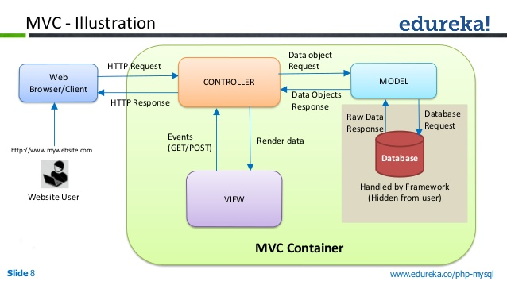
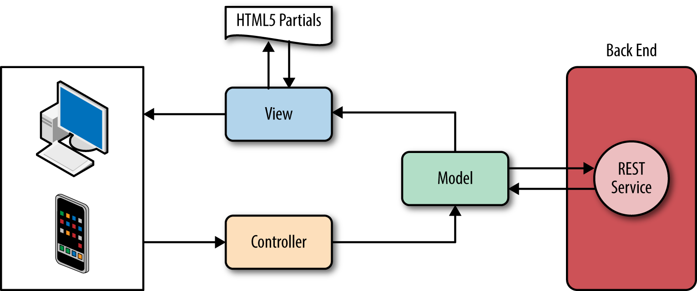
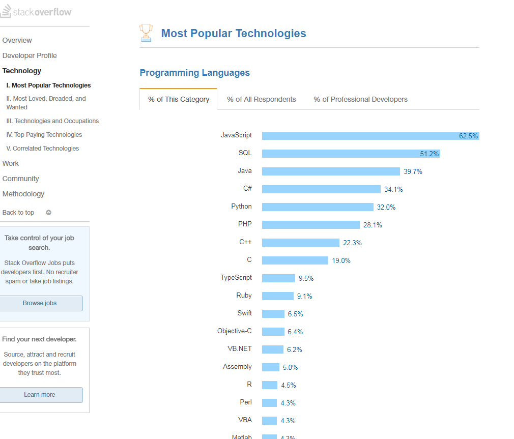
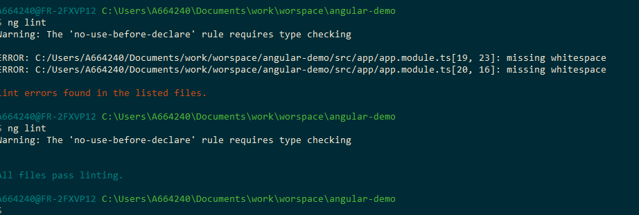
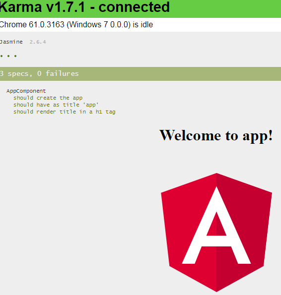
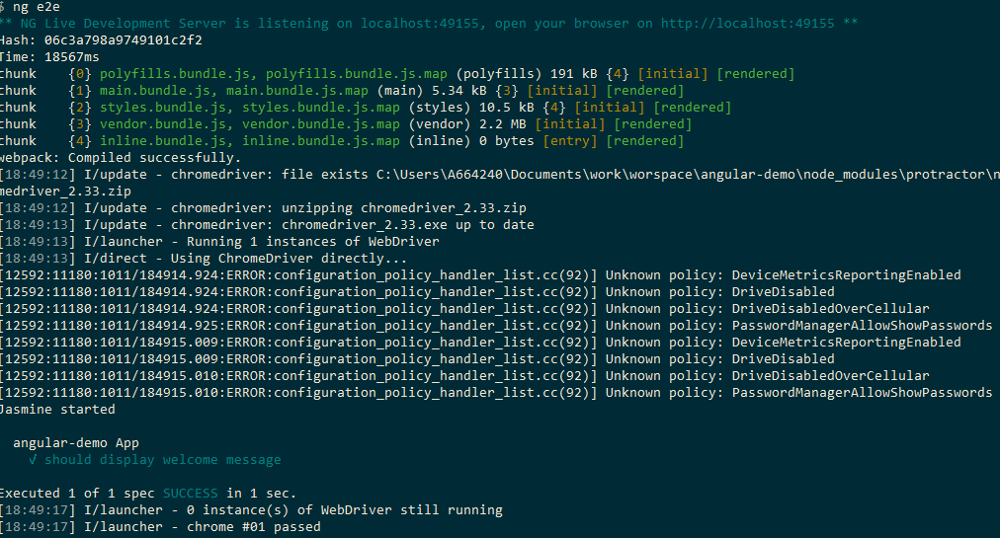
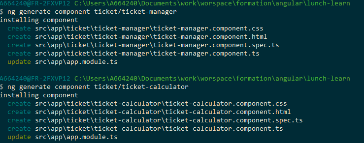

<!-- $theme: gaia -->
<!-- page_number: true -->

Angular
===


# 

##### winter 2017 - Lunch & Learn

---


Stack - Before
===

# 


- Model MVC backend

---

Stack - After
===

# 


- Model MVC front-end


---

Trends
===

 

---

Requirements
===

<center>


</center>

 - node 6.9.x +
 - npm 3.x.x +

---

Angular - Getting start
===

1. Install the cli
```
npm install -g @angular/cli
```
2. Create new project 
```
ng new demo-app --style=sass 
```
3. Serve
```
cd demo-app
ng serve --open
```

https://github.com/angular/angular-cli/wiki

---

Linter
===

- lint you app code using tslint.
```
ng lint
```

<center>



</center>


---

Unit test
===

- run the unit tests :
```
ng test
```

<center>



</center>

---

End to end test
===

- run the test :
```
ng e2e
```

<center>



</center>


---

Bootstrap 4 - (1)
===

Bootstrap 4.0.0.beta : http://getbootstrap.com/

install via npm :
```
npm install --save bootstrap@4.0.0-beta font-awesome
```
Import css in ```src/styles.css```

```
@import "~bootstrap/dist/css/bootstrap.min.css";
@import "~font-awesome/css/font-awesome.css";
```

---

Bootstrap 4 - (2)
===

Edit the ```src/app/app.component.html``` and ```src/styles.css```

```
<div class="container">
  <div>
    <h1>Angular CLI + Bootstrap</h1>
    <p class="lead">This tutorial shows how to use Bootstrap and Font Awesome with an app generated by Angular CLI.</p>
  </div>
</div>
```

```
body {
  padding-top: 5rem;
}
```
---

Bootstrap 4 - (3)
===

Create nav component
```
ng generate component nav
```
will create a folder ```src/app/nav/```

```
nav.component.ts      - The component class + definition 
nav.component.css     - The component stylesheet
nav.component.html    - The component template
nav.component.spec.ts - The component test spec class
```

Refer ```<app-nav></app-nav>``` in the ```app.component.html``` file

---

Bootstrap 4 - (4)
===

```
<nav class="navbar navbar-expand-md navbar-dark bg-dark fixed-top">
    <a class="navbar-brand" href="#">Angular CLI + Bootstrap</a>
    <button class="navbar-toggler" type="button" data-toggle="collapse" data-target="#navbarsExampleDefault" aria-controls="navbarsExampleDefault" aria-expanded="false" aria-label="Toggle navigation">
      <span class="navbar-toggler-icon"></span>
    </button>

    <div class="collapse navbar-collapse" id="navbarsExampleDefault">
      <<ul class="nav navbar-nav mr-auto">
          <li class="nav-item">
            <a class="nav-link"  routerLinkActive="active" routerLink="/home">Home </a>
          </li>
          <li class="nav-item">
            <a class="nav-link"  routerLinkActive="active" routerLink="/ticket-manager">Manager</a>
          </li>
          <li class="nav-item">
            <a class="nav-link"  routerLinkActive="active" routerLink="/ticket-calculator">Calculator</a>
          </li>
        </ul>
        <ul class="nav navbar-nav">
          <li class="nav-item">
            <a class="nav-link" href="/"><i class="fa fa-medium" aria-hidden="true"></i></a>
          </li>
          <li class="nav-item"> 
            <a class="nav-link" href="/"><i class="fa fa-twitter" aria-hidden="true"></i></a>
          </li>
          <li class="nav-item">
            <a class="nav-link" href="https://github.com/beeman"><i class="fa fa-github" aria-hidden="true"></i></a>
          </li>
        </ul> 
    </div>
  </nav>
```

---

Pages
===

- Add two componoent pages :


```
ng generate component ticket/ticket-manager
ng generate component ticket/ticket-calculator
ng generate component home/home
```

<center>



</center>


---

Routing (1)
===

in the ```app.module.ts``` add the router dependency 

```
import { RouterModule }   from '@angular/router';
```
Configure the router
```
RouterModule.forRoot([{
    path: 'ticket-manager',
    component: TicketManagerComponent
  },{
    path: 'ticket-calculator',
    component: TicketCalculatorComponent
  }
])
```

---

Routing (2)
===

Default routing : 
```
RouterModule.forRoot([{
        path: '',
        redirectTo : 'home',
        pathMatch: 'full'
      }...
])
```

Modify the main template ```app.component.html```

```
<app-nav></app-nav>
<div class="container">
  <div>
    <router-outlet></router-outlet>    
  </div>
</div>
```

---

Routing (3)
===

Set links in ```nav.component.html``` :

```
<li class="nav-item">
<a class="nav-link" routerLink="/home">Home </a>
</li>
...
```

Active link

```
<li class="nav-item">
<a class="nav-link" routerLinkActive="active" routerLink="/home" >Home </a>
</li>
...
```

---

Ticket manager
===

- Edit the ```ticket-manage.component.ts``` file
```
<div class="container">    
    <h1>Ticket manager</h1>
    <div class="container">      
      <div class="row alert alert-secondary " role="alert">
          <div class="col-md-7">
            test
          </div>
          <div class="col-md-3">
            test2
          </div>
          <div class="col-md-2">
            <button class="btn btn-sm btn-success" type="button" ><i class="fa fa-floppy-o "></i></button>
            <button class="btn btn-sm btn-primary" type="button" ><i class="fa fa-pencil "></i></button>            
            <button class="btn btn-sm btn-danger" type="button" ><i class="fa fa-trash-o "></i></button>
            
          </div>
      </div>
    </div>
    <div class="right">
      <button class="btn btn-primary">+ Add new ticket</button>
    </div>
</div>
```

--- 

Model Ticket 
===

Add new model ticket  ```model/ticket.model.ts```

```
export class TicketModel  {  
  owner:string; value:number;
}
```
Add list of tickets in a storage service ```ng generate service service/storage``` add it in ```provided section```
```typescript
ticket :  Array<TicketModel> = new Array<TicketModel>();
 
  constructor() { 
    let ticket = new TicketModel ();
    ticket.owner = "Jean";
    ticket.value = 12;
    this.tickets.push(ticket)    
  }
```

--- 

Injection Depencies IOC
===
Use the contstructor to inject the Storage Service

```typescript
tickets : Array<TicketModel>;
  constructor(private storageService: StorageService) {
    this.tickets = storageService.tickets;
   }
```

--- 

Directives - *ngFor
===

- Use the tickets variables

```
<div 
	*ngFor="let ticket of tickets"
    class="row alert alert-secondary " 
    role="alert">          
    <div class="col-md-7">
    {{ticket.owner}}
    </div>
    <div class="col-md-3">
    {{ticket.value}}
```

--- 

Component event
===
- in the ```ticket-manager.component.html``` file :
```
<button class="btn btn-primary" (click)="addTicket()">
	+ Add new ticket
</button>
```
- And in the ```ticket-manager.components.ts```file :
```
  addTicket(){
    const ticket = new TicketModel();
    ticket.owner='';    
    this.tickets.push(ticket);
  }

```
--- 

Directives - *ngIf
===
```
 <button type="button" class="btn btn-sm btn-primary" (click)="ticket.editable=true">
```
```
<span *ngIf="!ticket.editable">
	{{ticket.owner}}
</span>
<span *ngIf="ticket.editable">
	<input >
</span>
```

--- 

Two way binding
===

Import the form : 
```typescript
@NgModule({
  imports: [
    [...]
    FormsModule
  ],
  [...]
})
```
In the ```ticket-calculator``` template
```
  <input [(ngModel)] = "ticket.owner" name="owner" >
```

--- 

Service ticket calcul
===
Add new service ticket calcul with this method:
```typescript
calcul(total:number,tickets : Array<TicketModel>) 
	: Array<TicketResultModel>{
    return null;
  }
```
--- 

TDD approach
===
Create test in the ```ticket-calcul.service.spec.ts```
```typescript

  it('should calc 25', inject([TicketCalculService], (service: TicketCalculService) => {
    expect(service).toBeTruthy();
    let tickets : Array<TicketModel> = new Array<TicketModel>();
    {
      let t:TicketModel = new TicketModel();
      t.value = 5;
      tickets.push(t);
    }
    expect(service.calcul(25,tickets)[0].number).toBe(5);
  }));
```
Run the test ```ng test```

--- 

Event Binding
===
Add click event :
``` 
<button type="button" class="btn btn-primary" (click)="calc()" >Calculer</button> 
``` 
 And the method :
```
 calc() {    
    this.ticketsResult = this.ticketCalculService.calcul(this.total,this.tickets);
    this.totalResult = this.ticketCalculService.sumResult(this.ticketsResult);    
  }
```

---

Resources
===

https://angular-2-training-book.rangle.io/handout/advanced-components/elementref.html